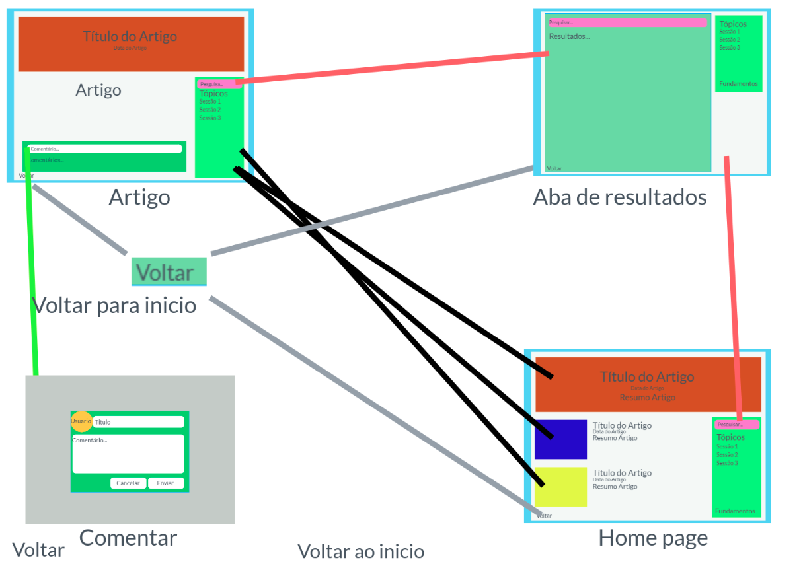
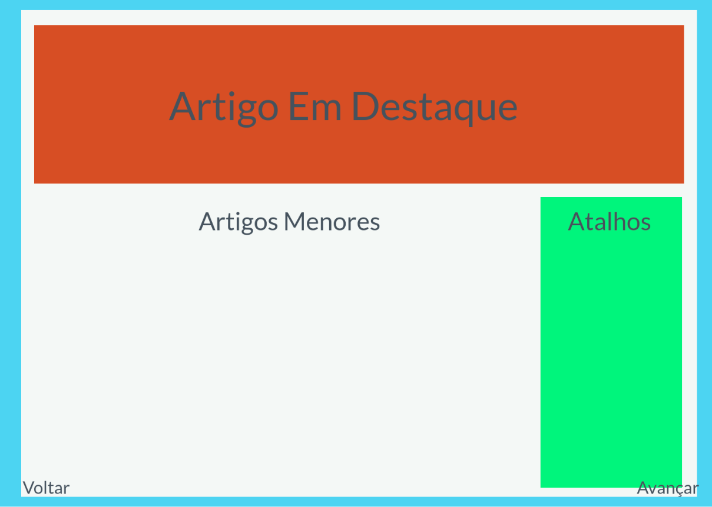
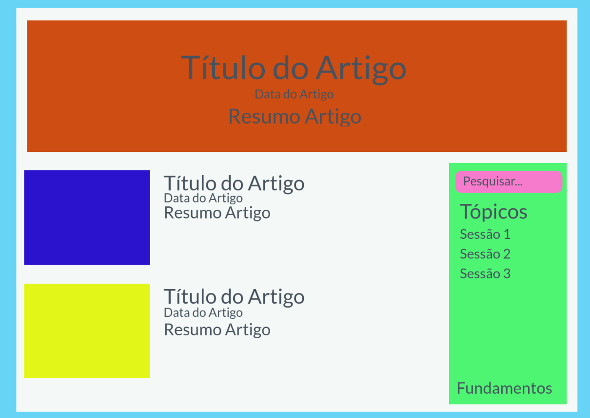
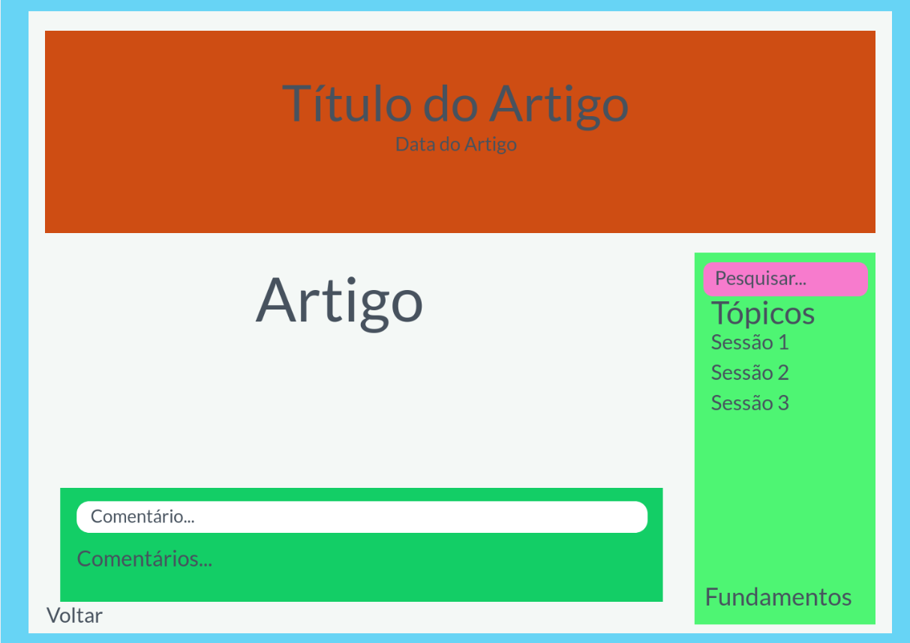
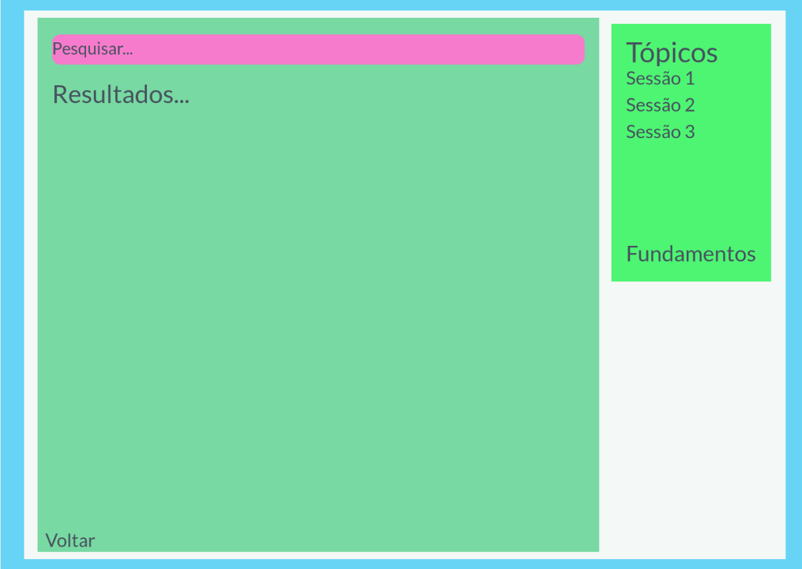
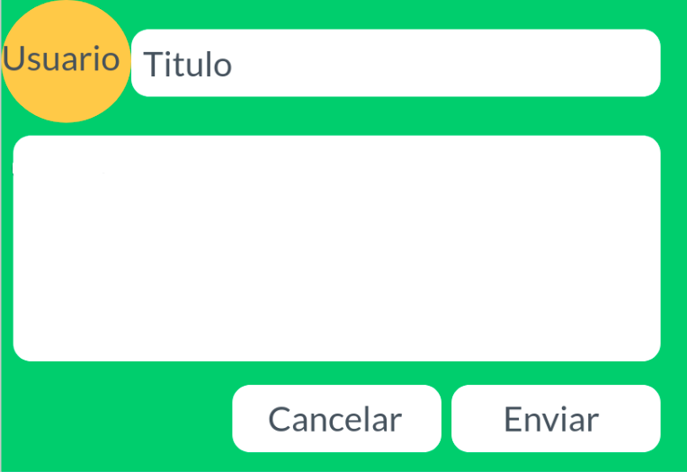

# Projeto de Interface

Dentre as preocupações para a montagem da interface do sistema, estamos estabelecendo foco em questões como agilidade, acessibilidade e usabilidade. Desta forma, o projeto tem uma identidade visual padronizada em todas as telas que são projetadas para funcionamento em desktops.

## User Flow

O diagrama apresentado a seguir mostra o fluxo de interação do usuário pelas telas do sistema. Cada uma das telas deste fluxo é detalhada na seção de Wireframes que se segue. Para visualizar o wireframe interativo, acesse o [ambiente Marvel do projeto](https://marvelapp.com/prototype/824dj9a/screen/89012975).

## Wireframes

Conforme fluxo de telas do projeto, as telas do sistema são apresentadas em detalhes nos itens que se seguem. As telas do sistema apresentam uma estrutura comum, onde existem 3 grandes blocos, descritos a seguir. São eles:

- **Cabeçalho:** local onde são dispostos elementos fixos de identidade (logo) e navegação principal do site (menu da aplicação);

- **Conteúdo:** apresenta o conteúdo da tela em questão;

- **Barra lateral:** apresenta os elementos de navegação secundária, geralmente associados aos elementos do bloco de conteúdo.

### Tela - Home-Page

A tela de home-page mostra as postagens em destaque e as mais recentes. 

Com base na estrutura padrão, o bloco de conteúdo traz as postagens em destaque, seguidas das postagens mais recentes, compostas de: imagem, título, data, resumo e ícone de compartilhamento. O bloco da Barra Lateral traz dois elementos distintos:

- Componente de **pesquisa** que permite substituir o conteúdo da página com o resultado da busca solicitada pelo usuário;
- Componente de **lista de categorias** que dá acesso às páginas de cada uma das seções disponibilizadas.

### Tela - Leitura Postagem

A tela de leitura de postagens apresenta as informações referentes a um artigo específico escolhido pelo usuário. O Menu Lateral apresenta os mesmos elementos da Home-Page e com a adição do componente de **postagens relacionadas**, que apresenta ao usuário outros posts sobre o mesmo assunto.

### Tela - Resultado de Pesquisa

Assim que o usuário informa um tópico de pesquisa, ao clicar no botão de pesquisa, ele é direcionado para uma tela em que aparecem as postagens associadas ao tópico informado.

### Tela - Incluir Postagem

Na tela que permite ao inserir uma postagem, deve-se informar o nome de quem está inserindo, o título da postagem, o texto e um resumo desse post em questão. Esta tela é exibida na forma de uma janela modal. Em seguida, deve-se confirmar ou cancelar a ação de postar. Na sequência, a tela é fechada voltando para o ambiente anterior.

