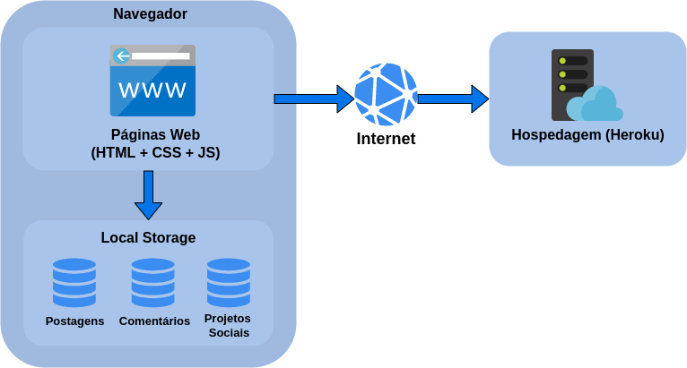

# Arquitetura da Solução

Nesta seção são apresentados os detalhes técnicos da solução criada pela equipe, tratando dos componentes que fazem parte da solução e do ambiente de hospedagem da solução.

## Diagrama de componentes

Os componentes que fazem parte da solução são apresentados na Figura que se segue.

A solução implementada conta com os seguintes módulos:
- **Navegador** - Interface básica do sistema  
  - **Páginas Web** - Conjunto de arquivos HTML, CSS, JavaScript e imagens que implementam as funcionalidades do sistema.
   - **Local Storage** - armazenamento mantido no Navegador, onde são implementados bancos de dados baseados em JSON. São eles: 
     - **Postagens** - publicações do portal 
     - **Comentários** - registro de opiniões dos usuários sobre as postagens
     - **Projetos Sociais** - lista de projetos de ONGs para acesso durante a leitura de uma postagem
 - **Hospedagem** - local na Internet onde as páginas são mantidas e acessadas pelo navegador. 

## Tecnologias Utilizadas

HTML
CSS
JAVASCRIPT
HEROKU
GITHUB
VSCODE

## Hospedagem

O site utiliza a plataforma do Heroku como ambiente de hospedagem do site do projeto. O site é mantido no ambiente da URL: 

[https://portal-pets.herokuapp.com/](https://portal-pets.herokuapp.com/)

A publicação do site no Heroku é feita por meio da Command Line Interface (CLI) do Heroku. Para o deploy do site no Heroku, ele é feito automaticamente após um git push do código no repositório local da main branch, para o repositório Heroku remoto. 
