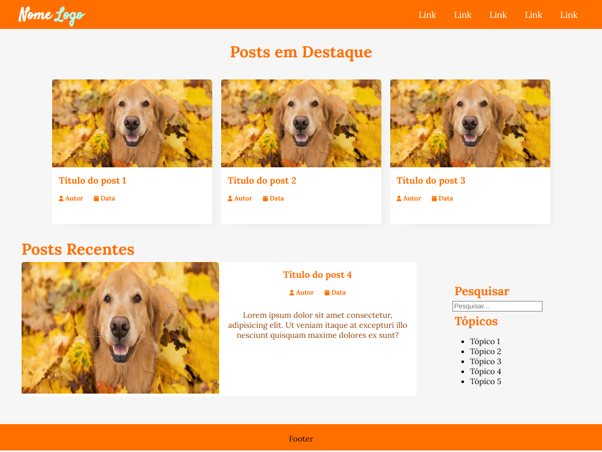
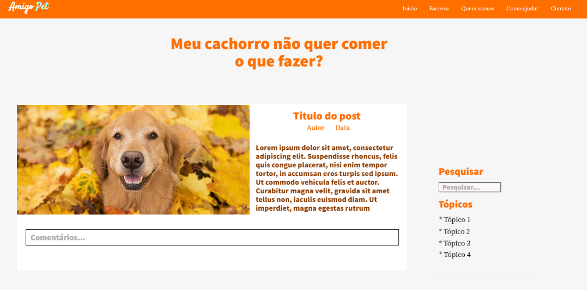

# Template padrão do site

O padrão de layout a ser utilizado pelo site tem correspondência ao projeto de Interface elaborado anteriormente, conforme o <a href="04-Projeto de Interface.md"> Projeto de Interface.</a>

O template criado é composto pelos seguintes layouts: 

- Tela principal
- Tela de visualização da postagem
- Modal de mensagens

## Tela Principal
Tela que abrange todas as visualizações iniciais do site e a lista de post em destaque e os mais recentes.

## Tela de Visualização da Postagem 
Tela que tem como objetivo mostrar uma certa Postagem e comentários da postagem. 

