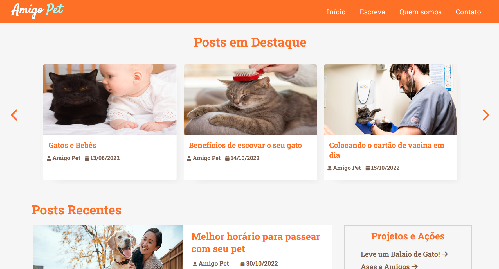
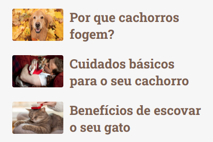
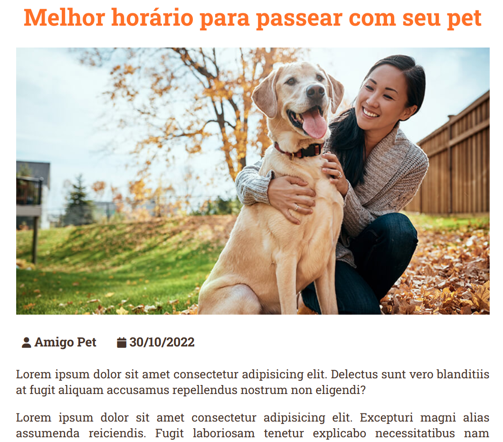
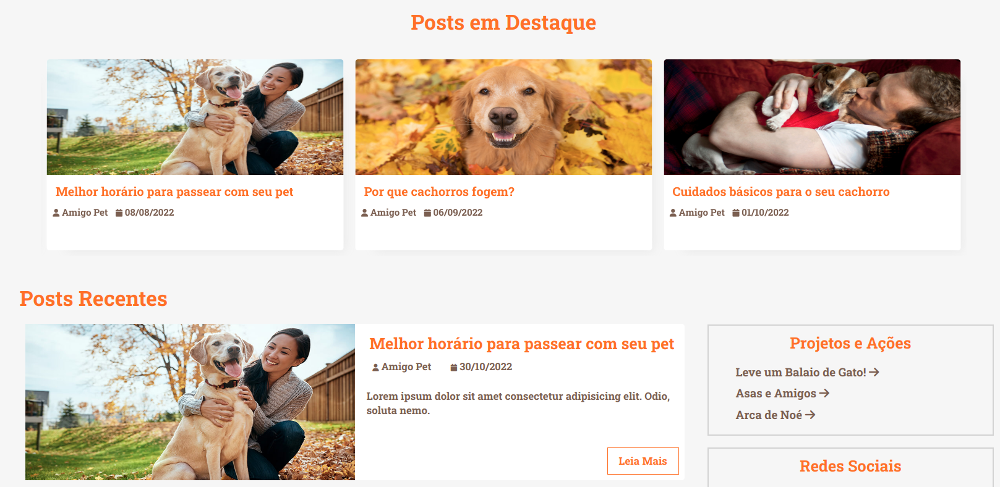
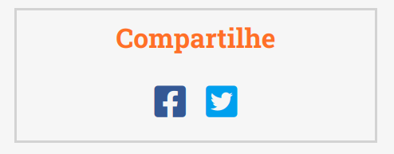
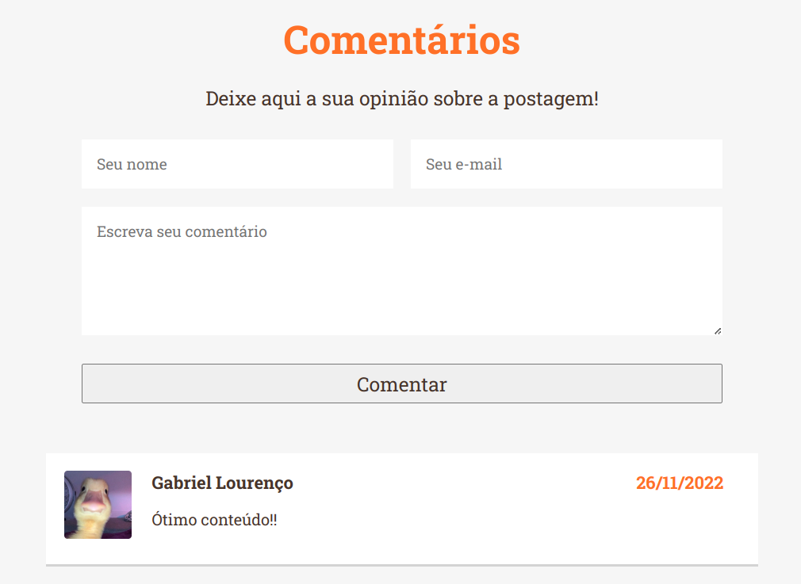
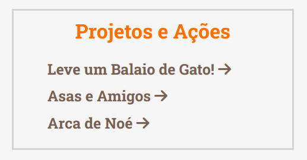
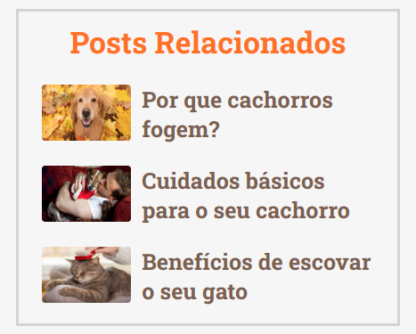

# Programação de Funcionalidades

Nesta seção são apresentadas as telas desenvolvidas para cada uma das funcionalidades do sistema. 

## Home do site (RF-01)

Página incial do site, ela contém tudo de relevante para quem quer se informar sobre cuidados com pets.

### Requisitos Atendidos 
- RF-01: O site deve apresentar na página principal dicas, guias e informações em geral sobre cuidados com pets.

### Artefatos de Funcionalidade
- [Home](https://amigo-pet.herokuapp.com/home.html)
- style.css

## Posts (RF-02)

Cada post do site contém uma imagem e um título próprio.

### Requisitos Atendidos 
- RF-02: O site deve apresentar, para cada postagem, uma imagem e um título correspondente.

### Artefatos de Funcionalidade
- [Home](https://amigo-pet.herokuapp.com/site/home.html)
- style.css
- /img/

## Visualização de Posts (RF-03)

Ao abrir um post do site o usuário se depara com uma tela contento o texto completo para se informar.

### Requisitos Atendidos 
- RF-03: O site deve permitir ao usuário visualizar o texto completo da postagem ao clicá-la.

### Artefatos de Funcionalidade
- [Post](https://amigo-pet.herokuapp.com/site/post.html)
- style.css

## Posts em Destaque e Recentes (RF-04)

Carrossel de postagens contendo 6 posts escolhidos para se destacarem na tela principal, sendo que apenas 3 são visualizados por vez. Esses posts vão circulando automaticamente. Abaixo do carrossel são colocadas as 3 notícias mais recentes do site.

### Requisitos Atendidos 
- RF-04: O site deve apresentar na página principal as postagens mais recentes e as em destaque.

### Artefatos de Funcionalidade
- [Home](https://amigo-pet.herokuapp.com/home.html)
- style.css
- /img/
- script.js

## Sidebar - Compartilhe (RF-07)
Sidebar mostrando ícones com links de compartilhamento da página nas redes sociais 

### Requisitos Atendidos 
- RF-07: O site deve permitir o compartilhamento de postagens em plataformas de redes sociais.

### Artefatos de Funcionalidade
- [Home](https://amigo-pet.herokuapp.com/home.html)
- style.css

## Comentários (RF-08 e RF-09)
Seção no final do texto de um post com espaço para o usuário escrever um comentário e ler o comentário de outros usuários.

### Requisitos Atendidos 

- RF-08: O site deve permitir que usuários possam comentar as postagens.
- RF-09: O site deve exibir os comentários registrados ao final da postagem.

### Artefatos de Funcionalidade
- [Post](https://amigo-pet.herokuapp.com/site/post.html)
- style.css
- script-post.js

## Cabeçalho do Site (RF-12)

Cabeçalho padrão para as telas de visualização do site. Ele funciona como atalho de navegação para pontos chaves do portal. Esse menu tem uma regra para telas menores onde as funcionalidades do menu ficam escondidas e só aparecem ao clicar nas 3 listras

### Requisitos Atendidos 
- RF-12: O site deve possuir um painel com atalhos dos principais tópicos

### Artefatos de Funcionalidade
- [Home](https://amigo-pet.herokuapp.com/home.html)
- style.css

## Sidebar - Projetos e Ações (RF-13)
Sidebar mostrando alguns links de Projetos e Ações ( ONGs )

### Requisitos Atendidos 
- RF-13: O site deve permitir ao usuário encontrar projetos sociais de ONGs cuidadoras de animais.

### Artefatos de Funcionalidade
- [Home](https://amigo-pet.herokuapp.com/home.html)
- style.css

## Sidebar - Postagens Relacionadas (RF-15)
Sidebar mostrando alguns links de outras postagens que são relacionadas com a que ele leu

### Requisitos Atendidos 
- RF-15: O site deve apresentar postagens relacionadas às que o usuário mais acompanha.

### Artefatos de Funcionalidade
- [Home](https://amigo-pet.herokuapp.com/site/post.html)
- style.css
