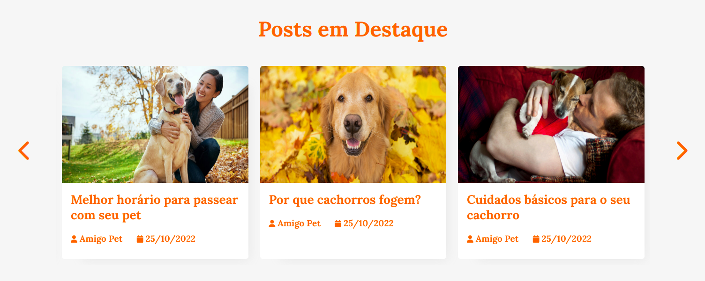

# Programação de Funcionalidades

Nesta seção são apresentadas as telas desenvolvidas para cada uma das funcionalidades do sistema. 

## Cabeçalho do Site (RF-12)

Cabeçalho padrão para as telas de visualização do site. Ele funciona como atalho de navegação para pontos chaves do portal. Esse menu tem uma regra para telas menores onde as funcionalidades do menu ficam escondidas e só aparecem ao clicar nas 3 listras

### Requisitos Atendidos 
- RF-12: O site deve possuir um painel com atalhos dos principais tópicos

### Artefatos de Funcionalidade
- [Home](https://amigo-pet.herokuapp.com/home.html)
- style.css

## Posts em Destaque (RF-04)

Carrossel de postagens contendo 6 posts escolhidos para se destacarem na tela principal, sendo que apenas 3 são visualizados por vez. Esses posts vão circulando automaticamente

### Requisitos Atendidos 
RF-04: O site deve apresentar na página principal as postagens mais recentes e as em destaque.

### Artefatos de Funcionalidade
- [Home](https://amigo-pet.herokuapp.com/home.html)
- style.css
- /img/
- script.js

## Sidebar (RF-07 e RF-13)
Sidebar mostrando alguns links de Projetos e Ações ( ONGs ) e links de compartilhamento da página nas redes sociais 

### Requisitos Atendidos 
- RF-07: O site deve permitir o compartilhamento de postagens em plataformas de redes sociais.
- RF-13: O site deve permitir ao usuário encontrar projetos sociais de ONGs cuidadoras de animais.

### Artefatos de Funcionalidade
- [Home](https://amigo-pet.herokuapp.com/home.html)
- style.css

## Modal de Comentários (RF-08)
Modal que aparece para comentar algum post

### Requisitos Atendidos 

- RF-08: O site deve permitir que usuários possam comentar as postagens.

### Artefatos de Funcionalidade
- [Comentário](https://amigo-pet.herokuapp.com/pages/modal-comentario.html)
